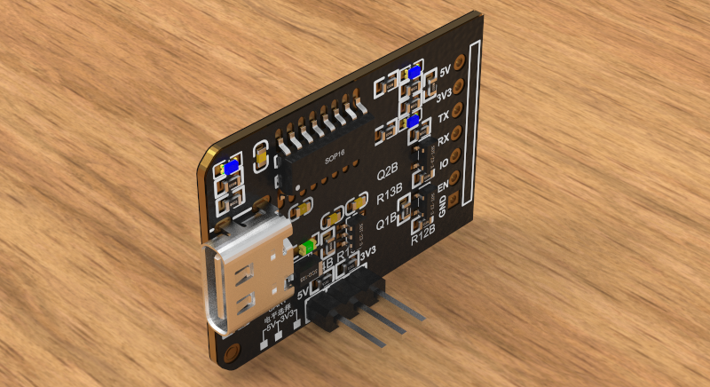
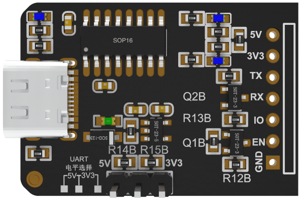
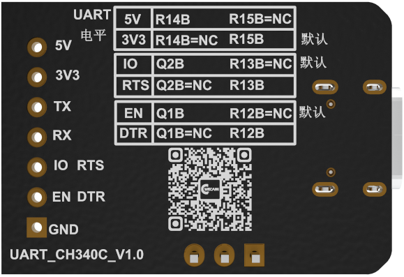

[中文](https://github.com/WeCanSTU/VersaPort-USB2Serial/blob/main/README_CN.md) / [English](https://github.com/WeCanSTU/VersaPort-USB2Serial/blob/main/README.md)

### **概述**

UMetav VersaPort是一款多功能、高性能的USB转串口工具，专为满足多种通信场景和开发需求而设计。它基于性能稳定的**CH340芯片**，不仅支持标准USB转串口功能，还特别优化了**ESP32和ESP8266固件烧录流程**，为开发者提供高效便捷的使用体验，是串口调试、嵌入式开发以及工业应用的理想选择。

  
  
<em>图 1: VersaPort串口工具概览</em>

### **主要功能**

1. **USB转串口功能**
    
    UMetav VersaPort默认配置为普通USB转串口功能，支持绝大多数设备通信调试，操作简单便捷。
    
2. **ESP32和ESP8266固件烧录支持**
    
    专为ESP32和ESP8266开发优化，内置一键固件烧录功能，免去繁琐设置，提供快速、高效的开发体验。
    
    

        
        
<em>图 2: VersaPort串口工具前视图</em>

    

    
### **三种主要工作模式**

1. **普通USB转串口模式**
    
    默认工作模式，适用于日常串口通信调试，支持广泛的设备和系统。
    
2. **ESP32和ESP8266固件烧录模式**
    
    优化ESP32和ESP8266固件下载流程，提供一键操作的高效烧录功能，为嵌入式开发者节约时间，提升效率。

    

        
        
<em>图 3: VersaPort串口工具后视图</em>

    

### **工具亮点**

- **多模式支持**：UMetav VersaPort支持普通USB转串口以及ESP32和ESP8266固件下载两种功能模式，灵活满足不同应用需求。
- **高扩展性**：提供资料支持用户调整硬件配置，轻松实现高度定制化。
- **便捷易用**：即插即用，兼容主流操作系统，无需复杂设置即可快速上手使用。
- **性能可靠**：基于CH340芯片，VersaPort提供稳定可靠的数据传输性能，适合各种通信场景。
- **专为开发优化**：集成ESP32和ESP8266烧录功能，免去繁琐步骤，让开发过程更加高效顺畅。

### **典型应用场景**

1. **串口设备通信调试**
    
    作为普通USB转串口工具，VersaPort适配各类串口设备，轻松实现设备间通信调试。
    
2. **嵌入式开发与调试**
    
    专为ESP32和ESP8266设计优化的固件烧录功能，为嵌入式开发人员提供便捷高效的工具支持。

### **总结**

UMetav VersaPort是一款集**灵活性、可靠性和高效性**于一体的USB转串口工具。它兼具普通串口通信和ESP32、ESP8266固件烧录两大功能，能够满足各种复杂的开发与调试需求。工具提供开放的配置资料，便于用户针对特定场景调整硬件参数，进一步提升性能。无论是日常调试、工业应用，还是嵌入式开发，UMetav VersaPort都将成为您的得力助手，为您的工作带来前所未有的便捷和效率！

## **资源与支持**

- **论坛**: [模组](https://forum.umetav.cn/t/module)
    - **开放时间**: 北京时间每日早上8点到凌晨1点。
- **QQ群**: 786239575
- **技术支持邮箱**：[tech@umetav.cn](mailto:tech@umetav.cn)
